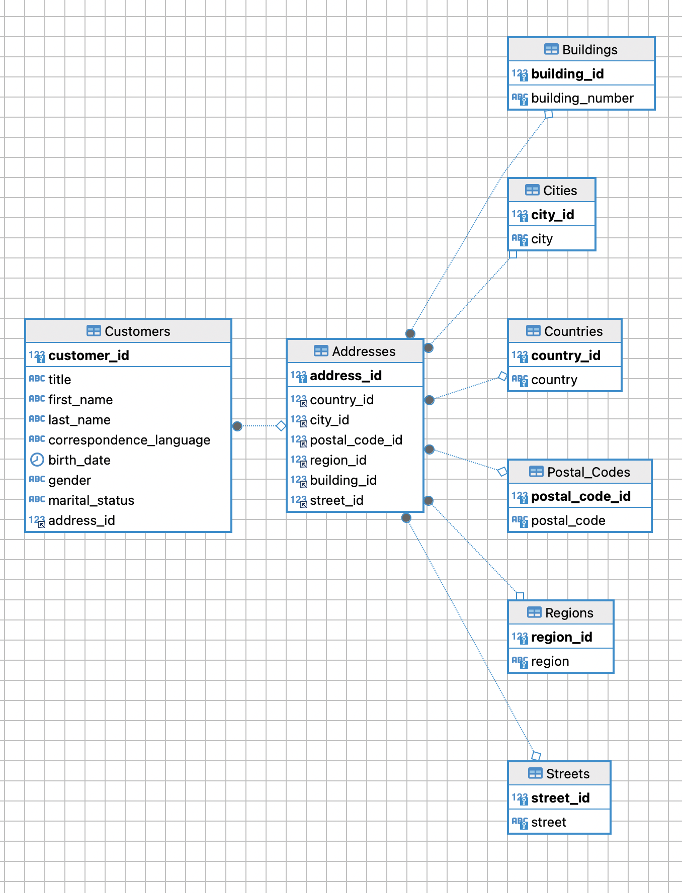

# Домашнее задание
Строим модель данных
## Цель:

* Научиться проектировать БД

## Описание/Пошаговая инструкция выполнения домашнего задания:

Задача: реализовать модель данных БД, определить сущности, построить связи, выполнить декомпозицию и нормализацию
За основу берем практическую структуру данных с заказчиками интернет магазина (файл some_customers.csv.gz).
Текущая структура данных неоптимальна:

нет типизации - почти все поля хранятся как строки
данные не нормализованы - данные о адресе и человеке хранятся в одной таблице, на одного человека может приходится несколько адресов
Попытаться выделить следующие сущности:
страны
города
улицы
дома
и другие которые посчитаете нужными
Описанные сущности не являются полным и конечным ТЗ (как это и бывает в жизни). Вы как архитектор должны предусмотреть необходимые атрибуты и дополнительные сущности по необходимости. И четко представлять бизнес-задачу которую будет решать эта структура данных.
делаем декомпозицию и нормализацию
в качестве сделанной ДЗ принимается pdf с начальной и конечной моделью
Решая данное ДЗ вы тренируете навык проектирования БД, выделения сущностей и их атрибутов, построения связей, нормализации данных

Задание повышенной сложности*
плюс 10 баллов загрузить данные из CSV в вашу модель
плюс 3 балла за развернутый кластер innodb с роутером и проверкой работоспособности

## Критерии оценки:

9 баллов - задание выполнено, но есть недочеты
10 баллов - задание выполнено в полном объеме

## Решение:


### 1. Запуск контейнеров

```shell
docker-compose -f docker/docker-compose.yml up
```

### 2. Проверка запущенных контейнеров

```shell
docker ps
```

### 3. Вход в контейнер primary

```shell
docker exec -it my_bd bash
```

### 4. Запускаем скрипт для финального парсинга таблицы Customers(Почему-то в автоматическом режиме не хочет)

```sql
LOAD DATA INFILE '/some_customers.csv'
    INTO TABLE Customers
    FIELDS TERMINATED BY ','
    ENCLOSED BY '"'
    LINES TERMINATED BY '\n'
    IGNORE 1 LINES
    (@title, first_name, last_name, @correspondence_language, @birth_date, @gender, @marital_status, @country, @postal_code,
     @region, @city, @street, @building_number)
    SET title = IF(@title = "", NULL, @title),
        correspondence_language = IF(@correspondence_language = "", NULL, @correspondence_language),
        birth_date = IF(@birth_date = "", NULL,STR_TO_DATE(@birth_date, '%Y-%m-%d')),
        gender = IF(@gender = "", NULL, @gender),
        marital_status = IF(@marital_status = "", NULL, @marital_status),
        address_id = (SELECT a.address_id
                      FROM Addresses a
                               LEFT JOIN Countries c ON a.country_id = c.country_id
                               LEFT JOIN Cities ci ON a.city_id = ci.city_id
                               LEFT JOIN Postal_Codes pc ON a.postal_code_id = pc.postal_code_id
                               LEFT JOIN Regions r ON a.region_id = r.region_id
                               LEFT JOIN Streets s ON a.street_id = s.street_id
                               LEFT JOIN Buildings b ON a.building_id = b.building_id
                      WHERE (c.country = @country OR @country = "")
                        AND (ci.city = @city OR @city = "")
                        AND (pc.postal_code = @postal_code OR @postal_code = "")
                        AND (r.region = @region OR @region = "")
                        AND (b.building_number = @building_number OR @building_number = "")
                        AND (s.street = @street OR @street = "")
                      LIMIT 1);
```

### 5. Проверяем содержимое таблицы Customers

```sql
SELECT * FROM Customers;
```

```
 customer_id|title          |first_name      |last_name                  |correspondence_language|birth_date|gender |marital_status|address_id|
-----------+---------------+----------------+---------------------------+-----------------------+----------+-------+--------------+----------+
          1|Dr.            |Danilo          |Ambrosini                  |IT                     |1900-01-01|Unknown|              |         1|
          2|Mrs            |Deborah         |Thomas                     |                       |          |Female |              |         2|
          3|Herr           |Markus          |Hönninge                  |DE                     |1900-01-01|Male   |              |         3|
          4|Mrs            |Sheila          |Spiller                    |EN                     |          |Unknown|              |         4|
          5|Mrs            |Rosemary        |Bailey                     |EN                     |          |Unknown|              |         5|
          6|Mr             |G               |Russell                    |EN                     |1900-01-01|Male   |              |         6|
          7|Mr             |Mark            |Robins                     |EN                     |          |Male   |              |         7|
          8|Mrs            |Elaine          |Thomson                    |EN                     |1900-01-01|Female |              |         8|
          9|               |Mario           |Bartolucci                 |IT                     |1900-01-01|Male   |              |         9|
         10|Herr           |Marvin          |Brockob                    |DE                     |1900-01-01|Male   |              |        10|
         11|Mrs            |Kathleen        |Renshaw                    |EN                     |          |Female |              |        11|
         12|Frau           |Katharina       |Meyer                      |DE                     |1900-01-01|Female |              |        12|
 ```

### 6. Схема сформерованно БД


